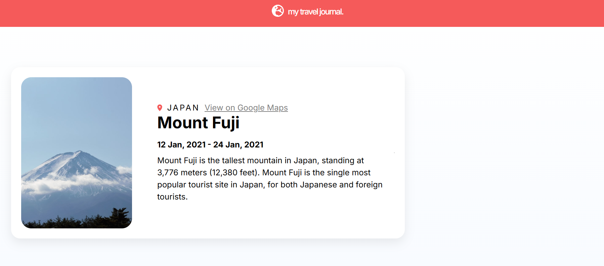
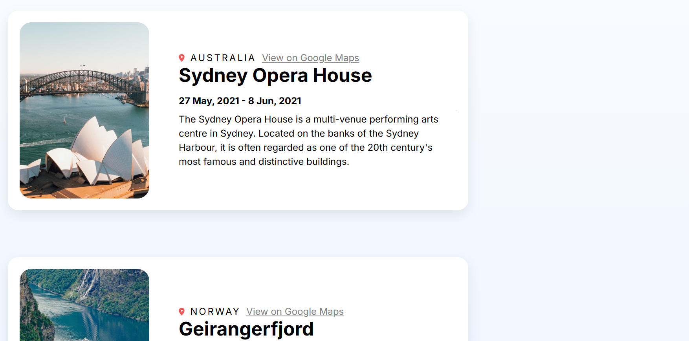

# 🌍 Travel Journal

A simple React application built while learning the fundamentals of React. This project displays a collection of travel destinations using reusable components and dynamic data, helping reinforce core React concepts like props, component composition, and rendering lists.

## Preview

**Travel Journal Preview**



## Features

- Built with React and Vite
- Component-based architecture
- Reusable travel card components
- Displays destination images and trip details
- Google Maps links for each location
- Clean and responsive user interface
- Organized project structure

## Technologies Used

- React
- Vite
- JavaScript (ES6+)
- JSX
- CSS3

## Project Structure

```text
src/
├── App.jsx
├── Header.jsx
├── Entry.jsx
├── data.js
├── assets/
├── index.css
└── main.jsx
```

## Getting Started

### Clone the repository

```bash
git clone https://github.com/ajwazameer/travel-journal.git
```

### Navigate to the project

```bash
cd travel-journal
```

### Install dependencies

```bash
npm install
```

### Start the development server

```bash
npm run dev
```

Open your browser and visit:

```text
http://localhost:5173
```

## What I Learned

During this project, I practiced:

- Creating reusable React components
- Passing data through props
- Rendering lists with `map()`
- Organizing components and assets
- Working with local data
- Structuring a React application
- Styling responsive layouts with CSS
- Setting up a React project using Vite

## Author

**Ajwa Zameer**

GitHub: https://github.com/ajwazameer

## License

This project is for educational purposes as part of my React learning journey.
